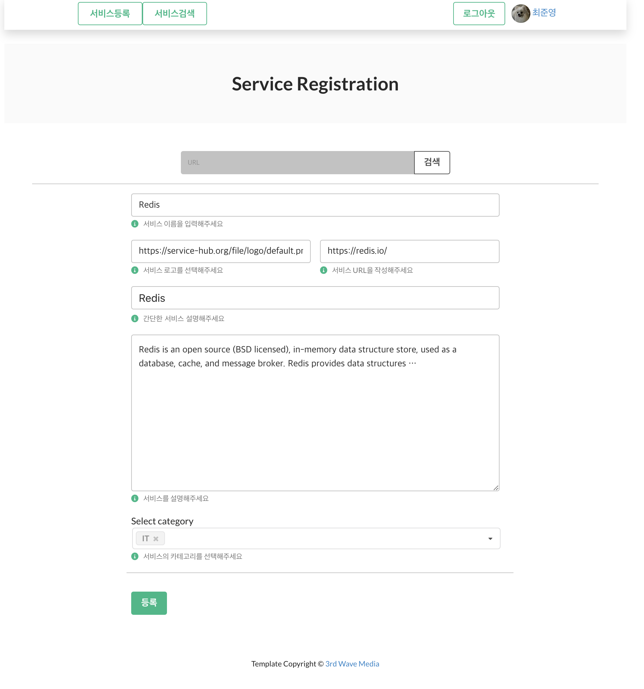
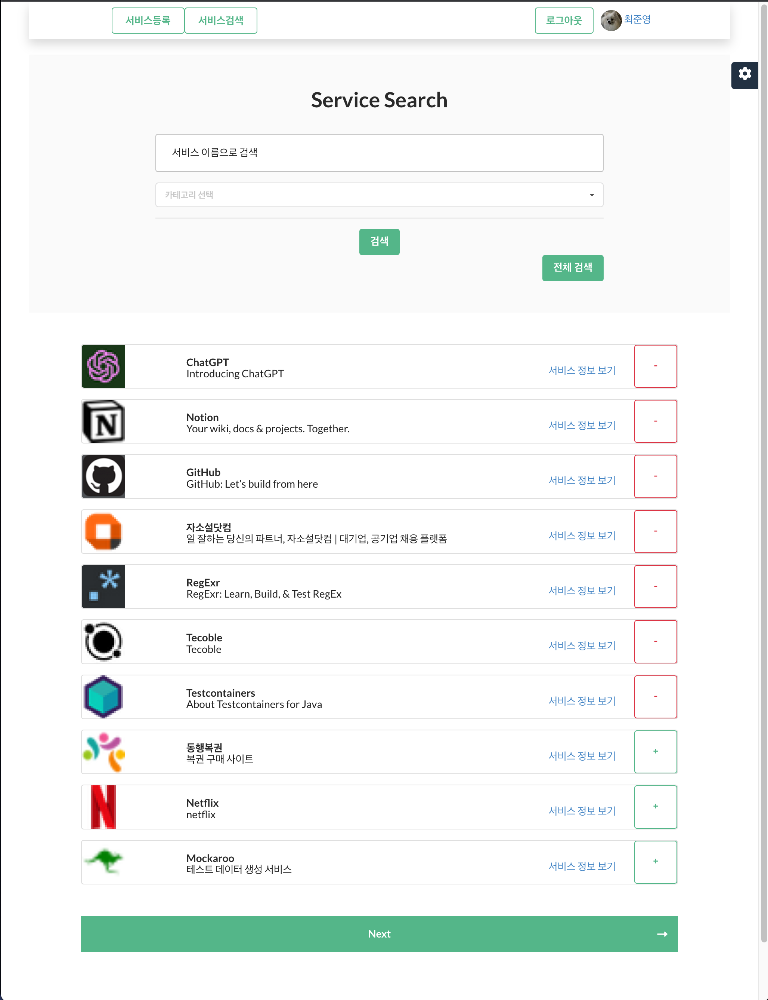
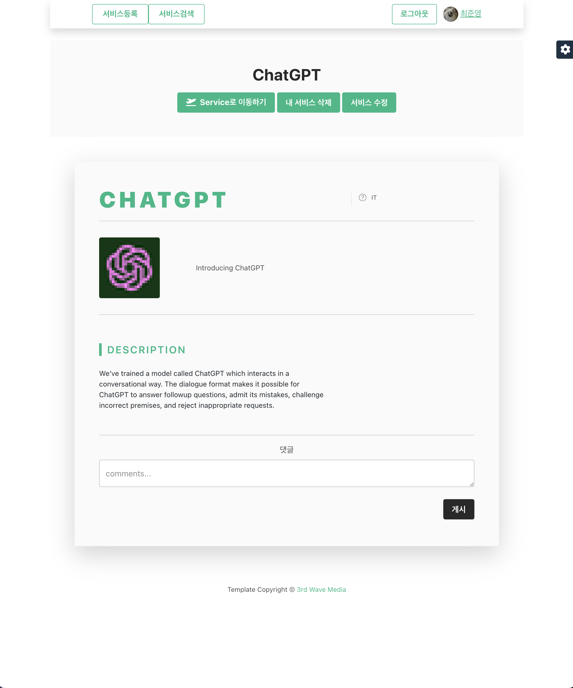
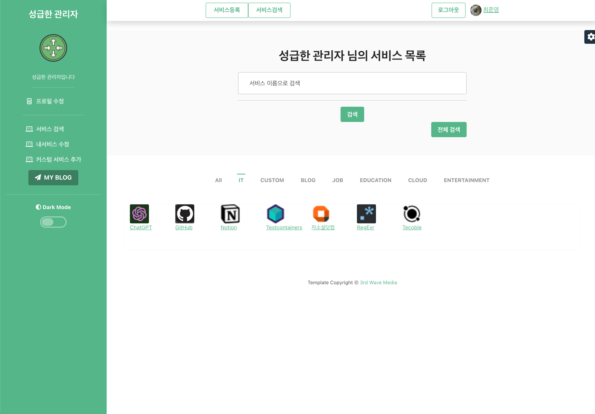

# Service-Hub

모든 서비스가 모이는 곳

https://service-hub.org

---

사용자가 사용하는 서비스를 모두 기억할 수 없을 만큼 인터넷에는 수많은 서비스들이 존재한다.

우리는 브라우저의 북마크 기능을 사용하여 유용한 서비스들을 저장하고 관리한다.

서비스 허브는 북마크 기능보다 고도화된 기능을 제공한다.

사용자는 이용하고 있는 서비스를 추가 및 관리할 수 있으며 여러 서비스를 조회할 수 있다.

대중적인 서비스가 무엇인지 알 수 있으며 알지 못했던 새로운 서비스를 접할 수 있는 경험 또한 제공한다.

## 분석

---

- 관리자가 서버에 서비스를 등록한다

    - 서비스 url 를 입력하면 서비스의 메타 정보를 Jsoup 라이브러리를 이용하여 크롤링한다.
    - 서비스 요구사항에 충족하지 못한 정보는 관리자가 채운다.

- 사용자는 서비스 이름 또는 서비스 카테고리를 이용하여 서버에 등록된 서비스를 조회해볼 수 있다.
    - 서비스는 해당 서비스를 추가한 사용자가 많은 순으로 정렬하여 보여준다.
    - 사용자는 서비스를 바로 사용자 서비스로 추가 혹은 삭제할 수 있다.

- 사용자는 서버에 등록된 서비스의 정보를 볼 수 있으며 서비스에 대해 댓글로 의견을 나눌 수도 있다.

- 사용자는 자신만 이용할 수 있는 커스텀 서비스를 등록하여 관리 및 이용할 수 있다.

- 서비스 요청 기능으로 사용자는 관리자에게 자신이 원하는 서비스 등록을 요청할 수 있다.
---

## 개발 환경

* Intellij IDEA Ultimate 2022.3.2
* Java 11
* Gradle
* Spring Boot 2.7.7

---

## 기술 세부 스택

* Spring Boot
* Spring Web
* Spring Data JPA
* Thymeleaf
* Spring Security
* H2 Database
* MySQL Driver
* Lombok
* Spring Boot DevTools
* Spring Configuration Processor
* jsoup
* javascript

---

## 배포 환경과 기술

* Docker
* Google Cloud Platform
* Linux
* Nginx
* Keycloak

## Result

---

## 등록

## 조회

## 서비스 페이지

## 사용자 페이지

