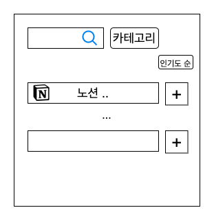

# 기능 목록

1. 서비스 검색 
    - 설명
        
        서버에 있는 서비스를 검색하여 조회할 수 있어야한다.
        
    - 세부 기능
        - 서비스 검색 시 카테고리 별로 검색할 수 있다.(ALL)
        - 인기순으로 검색할 수 있다. (ALL)
        - 정확도 순으로 검색할 수 있다 (ALL)
        - 바로 서비스를 추가할 수도 있습니다. (USER)
        - 이미 서비스로 해논 유저가 검색했다면 취소 버튼 (USER)
    
    
---
2. 서버에 서비스 등록
    - 설명
        
        인터넷 웹에서 제공하는 서비스를 등록할 수 있어야한다. (ADMIN)

    
--- 
3. 서비스 페이지
    - 설명
        
        각 서비스는 개별 페이지를 가진다.
        
        - 서비스를 이미 등록한 사용자의 경우에는 서비스 추가하기 버튼이 없다 (USER)
        - 서비스를 이미 등록한 사용자는 구독중이면 서비스 취소하기 버튼이 있다(USER)
        - 댓글을 달 수 있다 (USER)
    - 보기 (ALL)
    
    
---
4. 개인페이지
    - 설명
        - 용자는 자주 사용하는 서비스 별로 정렬된 서비스를 제공받는다.(USER)
        - 카테고리 별 조회 가능
        - 자주 이용하는 순 조회 기능

   
---
5. 서비스 추천 알고리즘 개발. (TODO)
6. 대댓글 기능(TODO)
7. 커뮤니티 기능 ; 서비스 추가 요청 , 개선 사항 , 공지사항 , 커뮤니티 기능 등등(TODO)
8. …